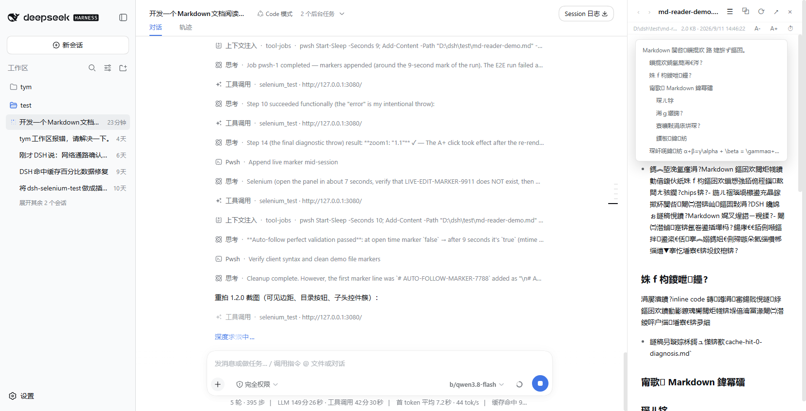

# dsh-md-reader —— DSH Markdown 阅读插件

点击 [DSH（DeepSeek Harness）](https://github.com/deepseek-ai) 会话中的 **Markdown /
图片文件链接**（消息里的文件提及按钮、产物文件 chips）时，不再交给系统默认程序，
而是在 **浏览器右侧详情栏** 内以真正的三栏布局直接阅读：

| 侧边栏 | 会话区 | MD 文档 |
|:---:|:---:|:---:|
| 固定宽 | 自动收窄 | 阅读产物区 |



## 特性

- **真三栏布局，非浮层遮罩**：打开文档时驱动 DSH 布局系统展开右侧详情栅格轨道，
  会话区真正收窄；面板宽度用 `ResizeObserver` 精确贴合轨道（含框架自带拖拽手柄
  调宽），两栏之间有分隔线，正文左右留白、超宽自动居中。
- **目录 TOC**：正文渲染后自动扫描 h1–h6，`☰` 一键展开层级目录，点击平滑滚动定位。
- **自动跟随**（⏱，默认开）：面板可见时每 3 秒探测文件 mtime，磁盘一变静默重载，
  滚动位置保持不乱飞——Agent 正在写的文档可以钉在右侧实时看。
- **图片内联预览**：png / jpg / jpeg / gif / webp / avif / bmp / ico / svg 点击即在
  栏内居中展示（data URL 内联，SVG 在 `` 中不执行脚本）；宿主半身不支持图片
  时自动回退系统打开，不会报错。
- **复制原文**（⧉）、**字号缩放**（A- / A+，70%–150% 持久化）、**重新读取**（⟳）、
  **历史前进/后退**（‹ ›）、**Esc 关闭**。
- **正文内导航**：正文 inline-code 记号若匹配「当前文档同级的 Markdown 文件」或
  相对 MD/图片路径，点击继续在同一面板内打开。
- **保留原生出口**：标题栏 `↗` 始终用系统默认程序打开（绕过插件自身拦截）。
- **明暗主题跟随**：复用平台 `MarkdownText` 渲染，外观全部走 `--dsw-alias-*`
  设计令牌。
- **双半身零构建**：宿主半身（Node）只读路由 + 浏览器半身手写 lazy-CJS bundle，
  无任何运行时依赖，不需要构建链。

## 安装

要求：DSH `>= 0.1.0-rc.6` 已安装并至少启动过一次（默认主目录 `%USERPROFILE%\.dsh`，
Windows PowerShell 5.1+）。

**方式一：官方插件命令（推荐，需 PATH 里有 pnpm）**

```sh
dsh plugin --profile web add github:wjx-ai/dsh-md-reader
```

包内 `cordis.patch.yml` 会作为 Profile Bundle patch 自动合并进 profile 层栈，
无需手工编辑。重启 `dsh web` 生效。

**方式二：一键脚本（复制到 profile 本地插件目录）**

```powershell
git clone https://github.com/wjx-ai/dsh-md-reader.git
cd dsh-md-reader
./install.ps1            # 自定义主目录：./install.ps1 -DshHome "D:\dsh-home"
```

脚本做两件事：复制插件到 `profiles\web\plugins\dsh-md-reader`；幂等地向
`profiles\web\cordis.patch.yml` 追加 insert 片段。不修改 DSH 安装目录、不重启进程。
卸载：`./uninstall.ps1`。

**方式三：手动**

1. 把 `package.json` 与 `lib/` 复制到 `%USERPROFILE%\.dsh\profiles\web\plugins\dsh-md-reader\`；
2. 在 `%USERPROFILE%\.dsh\profiles\web\cordis.patch.yml` 追加：

   ```yaml
   - insert:
       - id: md-reader
         name: ./plugins/dsh-md-reader/lib/index.js
   ```

**生效**：DSH 运行中且 web profile `patchReload: live` 时刷新浏览器即可（客户端
bundle 由 client-HMR 热换，宿主半身改动需重启后生效）。

## 使用

- 点击会话里任意 `.md / .markdown / .mdown / .mkd / .txt` 或图片文件链接 →
  右侧展开三栏阅读面板；
- 关闭后右下角保留 📖 悬浮入口，可重开最近文档（详情栏被工具详情占用时自动让位）；
- `☰` 目录、`⧉` 复制原文、`A-`/`A+` 字号、`⏱` 自动跟随、`⟳` 手动重载、`↗` 系统打开、
  `Esc` / `×` 关闭。

> 已知行为：右侧详情轨道由 DSH 布局系统管理，仅当「当前会话非空白」时可展开；
> 全新空白会话页下面板退化为浮层样式。正常使用中（点击消息里的文件链接）
> 会话必然非空白，三栏总是成立。

## 宿主半身 API 与安全边界

```
GET /api/md-reader/file?path=<绝对或相对路径>&base=<可选解析基目录>[&meta=1]
GET /api/md-reader/list?dir=<目录>
```

- `file`：文本返回 `{ ok, kind:'text', path, dir, name, size, mtime, content }`；
  图片返回 `{ ok, kind:'image', mime, data }`（base64 内联）；`meta=1` 只回元信息
  （供自动跟随轮询）；
- 扩展名白名单 `.md .markdown .mdown .mkd .txt` + 常见图片；大小上限：文本 2 MiB、
  图片 8 MiB、列表 500 条；
- 相对路径只解析到「会话 cwd（base 参数）或已注册工作区根」之内；
- webServer 绑定非回环地址时，绝对路径额外要求落在已注册工作区根内；
- 两条路由都在 `/api` 前缀下，经过 connection 服务的 Host/Origin 信任围栏与浏览器
  cookie 鉴权，未认证请求返回 401。全程只读，无写入端点。

## 客户端 bundle 集成契约（E2E 踩坑实录）

手写 DSH client bundle 时，以下几点与直觉不符，错任何一条都会表现为
「插件加载成功但 slot 里只剩 `data-slot-error` 空壳」：

1. **`createSnapshotStore(state, options)` 的首参是状态对象本身**，不是
   zustand 风格的 `() => state` 工厂——传函数的话，函数本身会被当作初始
   状态存进去，之后一切 `update` 都静默失效。
2. **`require("react/jsx-runtime")` 必须解构**：`let jsx = require("react/jsx-runtime").jsx`。
   把命名空间对象绑定成 `jsx` 再调用，会在组件渲染时抛
   `TypeError: jsx is not a function`，被 SlotErrorBoundary 捕获后整个条目被
   abdicate（仅控制台一条 `slot entry crashed` 日志）。
3. **jsx 运行时的第三参是 `key` 而非 children**：children 必须放进 props
   （`jsx(type, { ...props, children })`），放在第三参会静默丢内容（不报错）。
4. **`MarkdownText` 的 `labels` 至少需要**
   `{ footnotes, code: { copyLabel, copiedLabel } }`，缺 `code` 会在渲染
   代码块时抛 `Cannot read properties of undefined (reading 'copyLabel')`。
5. **右侧详情栏（`details`）是 single slot，被 ui-conversation 的 DetailsPanel
   占用**，直接注册会整栏替换、丢失工具调用详情。正确姿势：面板注册在
   `shell.overlay`（官方允许的 additive 列表槽），打开文档时经
   `ctx.layout.openDetails()` 展开真实栅格轨道（三栏成立），面板用
   `ResizeObserver` 贴合轨道宽度；关闭时 `closeDetails()` 收起；会话切换时
   AppFrame 自动收轨道，面板监听宽度归零跟随关闭。注意空白会话（`blank`）下
   布局会强制收起轨道，这是平台设计而非 bug。
6. **包装 `openWorkspacePath` 后要留住 original 引用**：面板上的「系统打开」
   按钮必须调原始函数，否则会再次被自己的包装截成面板打开（自截循环）。
7. 调试手段：slot 崩溃只在控制台留下 `slot entry crashed in '<slot>':` 一条
   日志；可在 bundle 顶部临时安装 `console.error` 捕获 + 屏显来定位，定位后移除。
8. **面板组件的 hooks 必须全部位于提前 `return null` 之前**：`!visible` 首帧
   与可见帧的 hooks 数量不一致会触发 React #310，slot 入口被整体卸载且无
   堆栈提示（1.2.1 实测踩坑）。

## 版本记录

- **1.2.3** 代码块排版：面板内代码块不再折行（`white-space: pre` + 横向滚动，
  ASCII 框线图不再被打散），代码字体改用中文等宽栈（`NSimSun`，ASCII 恰为
  汉字半宽，框线图列对齐精确）；README 首屏布局示意从 ASCII 框线图改为
  真 Markdown 表格（截图 `docs/readme-in-panel.png`）。
- **1.2.2** 表格改为 Word/Excel 风格实线网格：全边框（`border-collapse` +
  四边 1px 主题色边线）、表头底色加粗、`table-layout: fixed` + 收缩换行，
  多列表格在窄栏内等宽铺满、不再横向裁切（截图 `docs/table-grid.png`）。
- **1.2.1** 表格版式修复：宽表格（≥4 列）不再「hover 才出现滚动」，面板内始终
  可横向滚动且单元格允许收缩换行（多列表格在窄栏完整可见）；**围栏表格自动
  还原**——源文件里被 ``` 围栏包住的 Markdown 表格不再渲染成带「复制代码」
  按钮的代码块，而是直接还原为真表格（仅当围栏体每行都是表格行时才解包，
  其余代码围栏保持原样）。修复面板 hooks 顺序违规导致的 slot 崩溃
  （React #310，useMemo 必须位于提前 return 之前）。
- **1.2.0** 功能补全：正文左右边距与居中版式、目录 TOC（h1–h6 扫描 + 平滑滚动）、
  自动跟随磁盘变更（mtime 轮询 + 滚动位置保持）、图片内联预览（含旧宿主回退）、
  复制原文、字号缩放、Esc 关闭、`↗` 系统打开绕过自身包装。
- **1.1.0** 三栏布局：面板从固定浮层改为与 DSH 布局系统协同的详情栏形态；
  新增 📖 悬浮入口、会话切换自动收起；两半身 apply 全程防御式容错。
- **1.0.0** 首发：点击拦截 + 右侧浮层面板 + 只读路由。

## License

[MIT](LICENSE)
